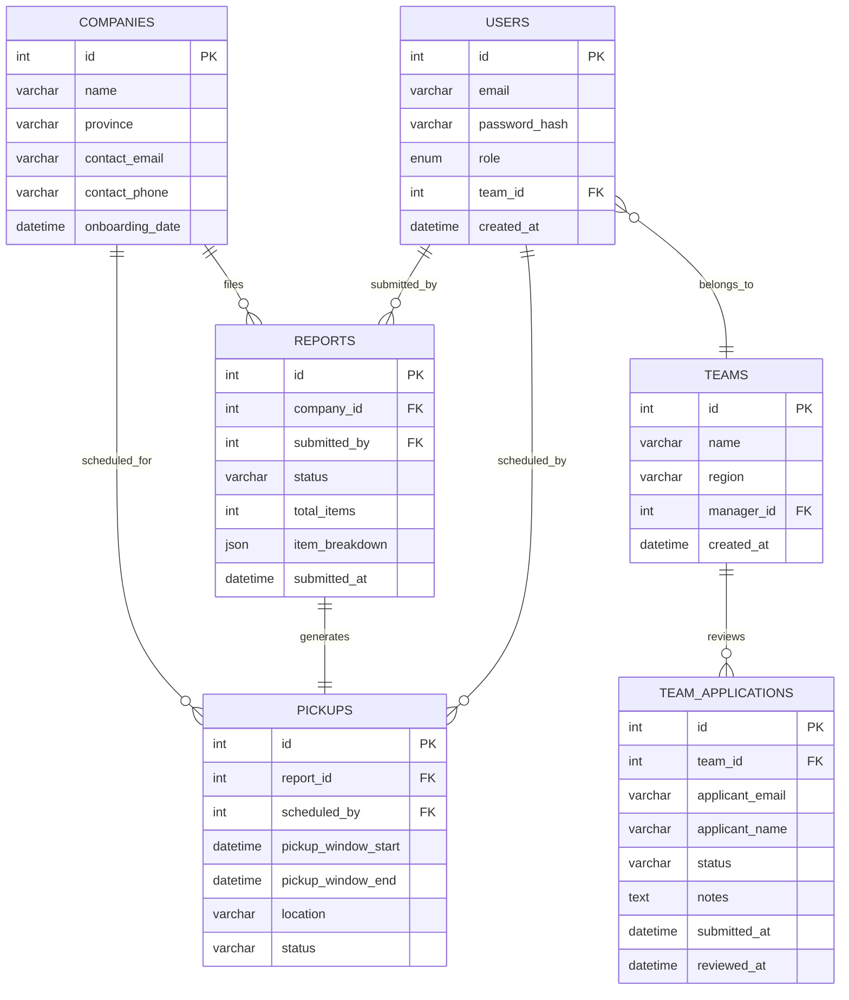

# ReportApp25 Draft ERD

```mermaid
erDiagram
    USERS ||--o{ REPORTS : "submitted_by"
    USERS ||--o{ PICKUPS : "scheduled_by"
    USERS }o--|| TEAMS : "belongs_to"
    TEAMS ||--o{ TEAM_APPLICATIONS : "reviews"
    COMPANIES ||--o{ REPORTS : "files"
    REPORTS ||--|| PICKUPS : "generates"
    COMPANIES ||--o{ PICKUPS : "scheduled_for"

    USERS {
        int id PK
        varchar email
        varchar password_hash
        enum role
        int team_id FK
        datetime created_at
    }

    COMPANIES {
        int id PK
        varchar name
        varchar province
        varchar contact_email
        varchar contact_phone
        datetime onboarding_date
    }

    REPORTS {
        int id PK
        int company_id FK
        int submitted_by FK
        varchar status
        int total_items
        json item_breakdown
        datetime submitted_at
    }

    PICKUPS {
        int id PK
        int report_id FK
        int scheduled_by FK
        datetime pickup_window_start
        datetime pickup_window_end
        varchar location
        varchar status
    }

    TEAMS {
        int id PK
        varchar name
        varchar region
        int manager_id FK
        datetime created_at
    }

    TEAM_APPLICATIONS {
        int id PK
        int team_id FK
        varchar applicant_email
        varchar applicant_name
        varchar status
        text notes
        datetime submitted_at
        datetime reviewed_at
    }
```
